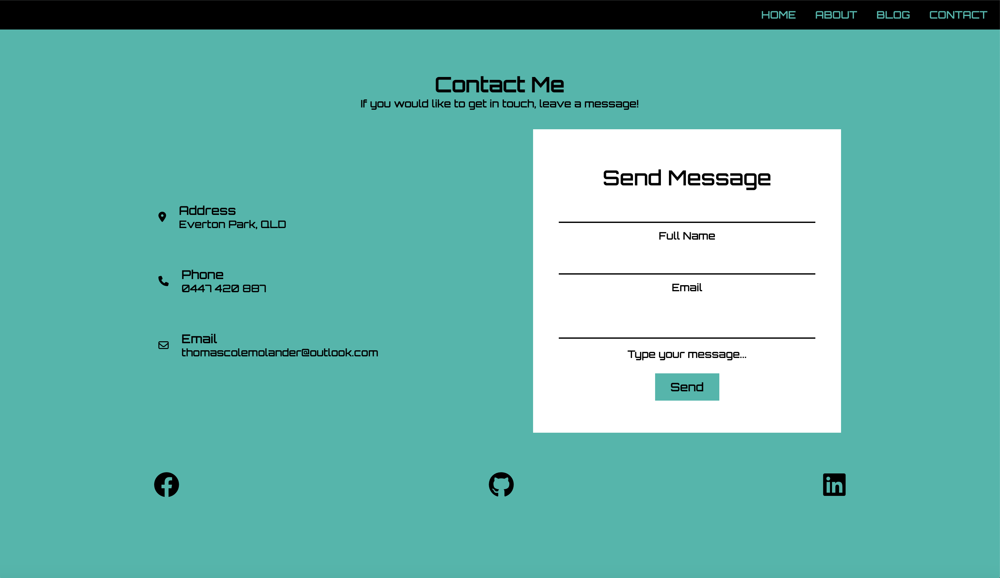

# Tom Molander - Portfolio Website

- Deployed Site: https://super-profiterole-c56616.netlify.app/
- Remote Repository: https://github.com/tom-molander/ThomasMolander_T1A2
- Presentation video: https://www.veed.io/view/2f9b4ad7-2b37-4306-8bc7-d0d3a6a36379?panel=share

### **Description**

This repository contains my first online portfolio written in HTML and SCSS. The repo contains all files and presentation slides with initial wireframe designs.

**Brief**

Create a portfolio website which presents you as a dev and IT professional. The purpose is to provide an online portfolio that provides information about you, your skills, interests, professional knowledge and a showcase of your work.

### **Purpose**

The purpose of this website, is to showcase my current programming skills to potential employers. It is also intended to provide a way to get in contact and some of my personal interests and hobbies.

### **Functionality / Features**

The website features four key pages, all with responsive design implemented for optimum viewing on mobile, tablet and desktop. All pages are accessible from the navigation menu at the top of the page and links to my social accounts can be found in the footer of each page. The site contains multiple links throughout the pages connecting the audidence to previous employment, DJ mixes & my resume.

All pages feature responsive layout design using flexbox and some media queries, uses imported font awesome icons and an imported google font with a fall back style.

**Site-Wide Features**

- Responsive hamburger nav bar, which turns into a side bar when using on mobile or tablet once interacted with.

- Footer with links to social media accounts.

**Page Specific Features**

- Home
  - Personal logo
  - Introduction statement with animated typing effect.
  - Button with link to about me page for users to follow along in a preferred method.
- About
  - Responsive image and texts with employment history, interests & resume.
- Blog
  - Six sample blogs on personal interests listed in previous page including title, date of publication and sample text.
- Contact
  - Contact information and message box to get in contact.

### **Sitemap**

Simple sitemap of the website:

### **Screenshots**

Home page:

About Page:

Blog Page:

Contact Page:

### **Target Audience**

This portfolio is tailored for employers seeking a skilled and dedicated web developer or IT professional. The target audience is expected to have technical knowledge related to information technology, software development, coding, programming languages, and development stacks. With a focus on professionalism and a positive work ethic, I aim to make a lasting impression on potential employers.

### **Tech Stack**

Tech Stacks used in the this portfolio:

- HTML5
- CSS
- Git & GitHub
- Netlify
